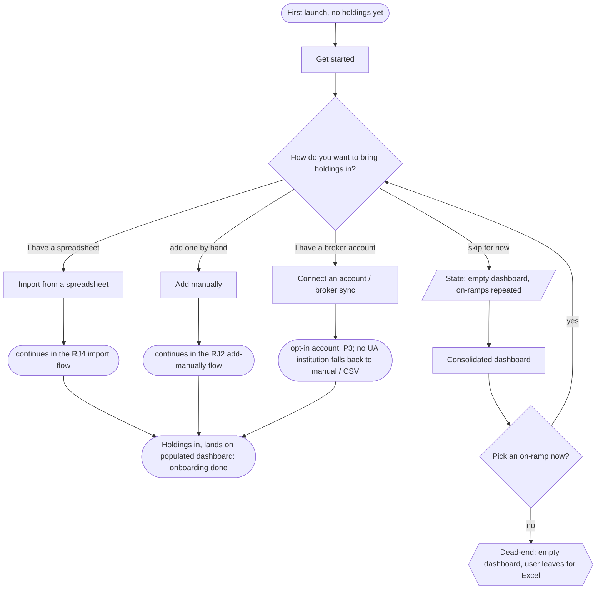
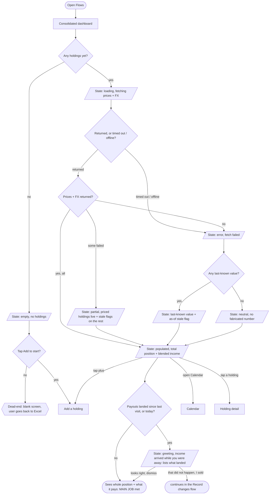
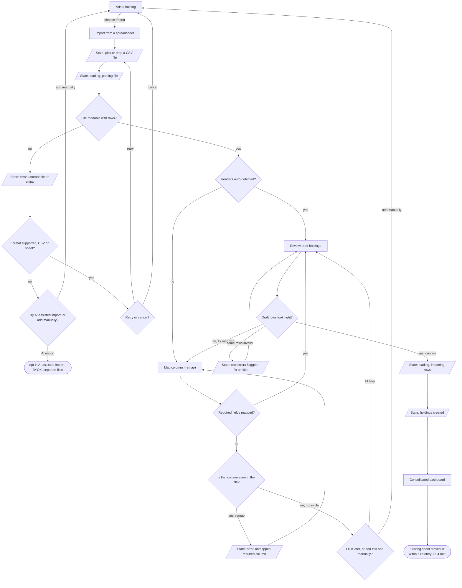
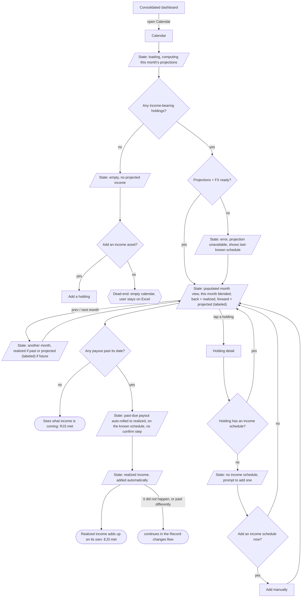
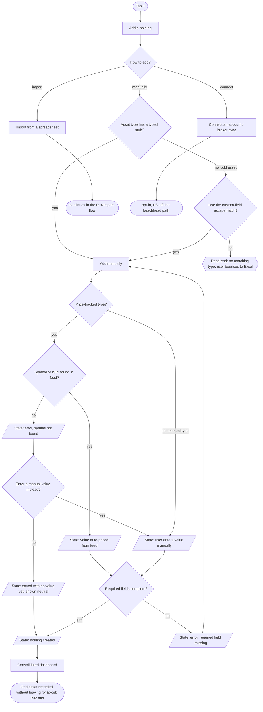
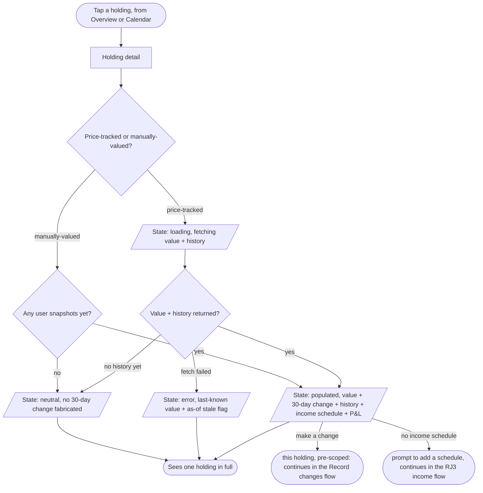
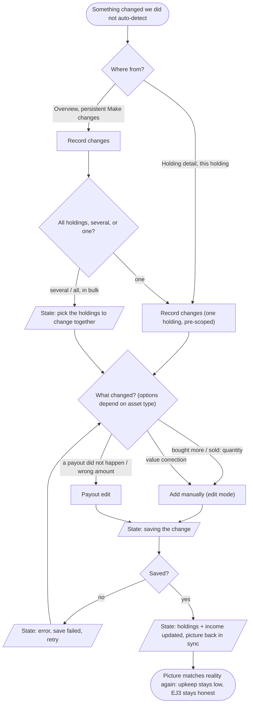
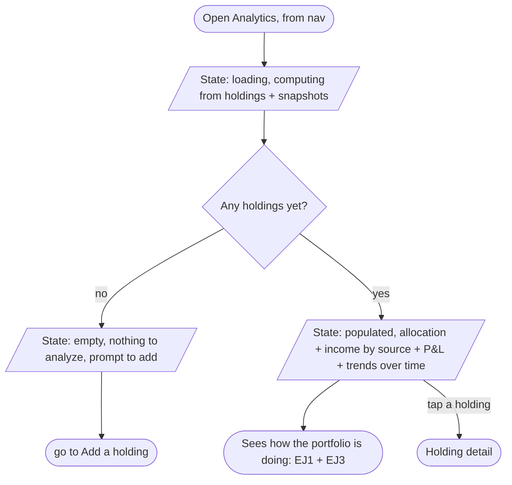
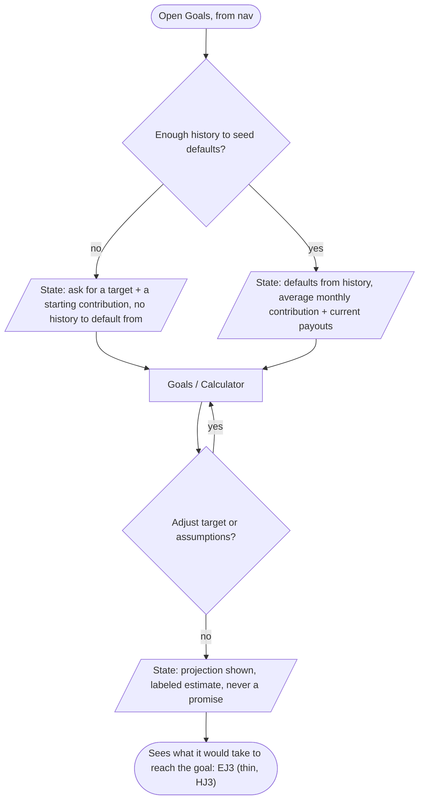

# Flows - User flows (draft)

Screen-to-screen flows for the load-bearing jobs, derived from [`sitemap.md`](sitemap.md) and [`jtbd.md`](../research/jtbd.md). One flow per job, each under its job heading. Drawn for the primary persona (P1, the Excel Consolidator) unless noted.

**Shape legend.**
- `["Screen"]` - a screen; every one exists in [`sitemap.md`](sitemap.md).
- `[/"State"/]` - a *state* of a screen (empty / loading / error / populated). Not a screen.
- `{"Decision?"}` - a branch point.
- `(["Terminal"])` - a start point or a success end.
- `{{"Dead-end"}}` - a place a person can get stuck or drop out.

Both ends are shown on purpose: the success path and the dead-ends, not just the happy path.

---

## Onboarding - first run, getting holdings in

> *Goal: keep a new user off the empty dashboard. The blank first screen is the one intentional dead-end in the main flow, so onboarding's job is to reach the user before that state and offer a way in.*

Onboarding offers the three on-ramps along the control-to-automation spectrum (manual / import / connect) before any empty state, so a new user is invited to import their sheet, connect a broker, or add one holding by hand rather than landing on a blank screen. No login is required: the local-first default lets a user fill their portfolio with no account, and only the connect path asks them to opt into one. Skip is allowed, but it lands on the empty dashboard that repeats the same on-ramps, so the dead-end is only reached by someone who declines help twice. The on-ramps feed straight into the existing import (RJ4) and manual (RJ2) flows below.

---

## MAIN JOB

> *When my money is spread across several platforms and I am piecing the picture together by hand, I want to understand my whole position and what it is paying me, faster than my spreadsheet does, so I can know where I stand without the manual upkeep.*

The dashboard is the landing screen, so the success end sits 0 taps in (matching the depth count in `sitemap.md`). The failure branches protect trust: a failed fetch, including a timeout or an offline launch that now routes to the same error state instead of hanging on a spinner, falls back to the last-known value with an honest "as of" flag, and where no value was ever fetched the holding stays neutral rather than showing a made-up number. The one real dead-end is the empty first run: a blank dashboard with no obvious next step sends the user back to the sheet, which is why the empty state must push into Add. That drop-out is kept on purpose, as honest churn rather than a design we can route our way out of. On the way in, the dashboard also re-checks the calendar: scheduled payouts auto-roll to realized silently (see RJ3), so a returning user is greeted with what landed while they were away - an informing delight, not a confirm gate - and that greeting is the natural place to drop into Record changes if a surfaced payout did not actually happen.

---

## RJ4 - Move in without redoing the work

> *When I already track this in a spreadsheet, I want to bring it across without re-entering everything, so I can switch without losing the work I have done.*

The happy path is auto-detect straight to review. The remap screen is the safety net when detection misses a column; if a required column simply is not in the file, the user can fill it later or drop to manual add instead of looping on the same error. The review screen is where bad rows are caught before they pollute the portfolio. An unsupported file is no longer a dead-end: it offers the optional AI-assisted import (PDF/image, a separate BYOK path) or a fall-through to manual add, and a plain cancel returns to Add rather than stranding the user.

---

## RJ3 - See income coming and arriving

> *When I depend on payouts from different assets, I want to see what is coming and what has already arrived across all of them, so I can plan around my income.*

This flow carries both the forward job (RJ3) and the realized track record (EJ3). The Calendar is a month view: you open a month and see its blended income, stepping back to realized months and forward to projected ones, where future figures are labeled "projected" so a forecast is never read as exact. It also plots the dated changes the user recorded (buys/sells from import or Record changes), with income as the lead layer. Realized income needs no per-payout tap: a payout past its date auto-rolls into realized on the schedule we already hold, so the calendar fills itself instead of nagging. The user only steps in when reality diverged - a payout that did not arrive, or paid a different amount - and that correction hands off to the Record changes flow below rather than living as a prompt on every payout. The quiet failure to watch for is the *silent gap*: a holding entered with no income schedule never appears in the calendar, so the user can believe their income is captured when it is not. Rather than leave that silent, the holding detail surfaces it as a prompt to add a schedule (reusing the manual form in edit mode), which is the reason the schedule belongs on the holding form, not as an afterthought.

---

## RJ2 - Hold everything I actually own

> *When I own something the usual apps do not fit (an Inzhur certificate, an OVDP line, a one-off), I want to record it anyway, so I do not fall back to a spreadsheet for the parts that do not fit.*

The escape hatch is the whole point of RJ2: when no typed stub fits, custom fields keep the user in the app instead of bouncing to Excel, so the *no escape hatch* branch is the dead-end that loses them. The price-tracked path used to strand the user when a symbol or ISIN was not found and they declined a manual value (the exact failure seen firsthand when Wealthfolio priced an OVDP ISIN at 0). Now declining still saves the holding with no value, shown neutral rather than fabricated, so it is never lost; a manual-value fallback stays on the form for when they do have a number.

---

## Holding detail - shared screen states

> *Holding detail is reached from both Overview and the Calendar by tapping a holding, so its states are drawn once here instead of repeated in each job flow. It is a screen, not a job: this catalogs how it behaves, not a new goal.*

Holding detail mirrors the dashboard's trust pattern at the single-holding level: a failed fetch falls back to the last-known value with an "as of" flag, and a holding with no history yet stays neutral rather than showing an invented 30-day change. The price-tracked / manually-valued split decides where the value comes from - a live feed with history, or the user's own snapshots - the same split the data model draws. Editing reuses the Add manually form in edit mode, and the no-schedule branch is the entry into the income-gap recovery shown in the RJ3 flow. P&L (unrealized gain/loss + total return) lives here as a section, deliberately kept off the dashboard.

---

## Record changes - keep the picture true when automation can't see it

> *Scheduled income auto-rolls to realized on its own (see RJ3), and the feeds keep prices fresh. So after setup the user touches their holdings only when reality diverged from what we know: they bought more, sold, or a payout did not happen the way the schedule says. This flow is the one persistent way to record that - in bulk or per holding - so the consolidated picture stays true without a per-payout prompt.*

Make changes is reached two ways: a persistent action on Overview, where the user can act on one holding, several, or everything at once, and a pre-scoped entry from Holding detail for that single holding. What the user can change is type-aware - a price-tracked stock offers quantity bought/sold, a manually-valued flat offers a value correction, an income-bearing asset offers a payout that did or did not land - so the form does not ask about fields the asset does not have. The leaves are screens that already exist: editing a holding reuses the Add manually form in edit mode, and correcting a payout opens the Payout edit screen. This is the deliberate counterpart to the silent auto-roll: because scheduled payouts are no longer confirmed one by one, the safety valve for the cases automation gets wrong has to be obvious and always within reach, not buried.

---

## Analytics & Goals - derived screens (no new data entry)

> *Both compute on the holdings already entered; neither adds data. Analytics is the "how am I doing" view, Goals the "am I on track" calculator. They are nav peers but evidence-thin (single survey asks, R23 for past/future interpolation, R26 for a contribution calculator), so they stay complementary to Overview and the Calendar.*

Analytics is read-only over the real data, so its only failure is the empty state before any holding exists; nothing is fabricated, and it is where P&L lives instead of the Overview hero. Goals is a scenario tool: it seeds from the user's own history where there is enough, asks for a target otherwise, and every projected figure is labeled an estimate - the same trust rule the Calendar's "projected" months carry, kept because the calculator's numbers rest on assumptions the live data cannot confirm. Both are reached in one tap from their nav entries and lead back into Holding detail or Overview; they deliberately add no data-entry path of their own.

---

## Deferred flows (P3, off the beachhead path)

Two screens in [`sitemap.md`](sitemap.md) have no flow drawn yet, on purpose: **Connect an account / broker sync** and **My data & privacy**. Both serve the trust-wary, automation-leaning persona (P3), off the primary Excel-consolidator path, and both carry failure states worth designing later (broker auth failure, no Ukrainian institution available, export error). They are deferred rather than omitted so the gap stays explicit, not silent.

---

*Each screen node above is listed in [`sitemap.md`](sitemap.md). The two import sub-steps, Map columns (remap) and Review draft holdings, were promoted to screens there when this flow needed them.*
